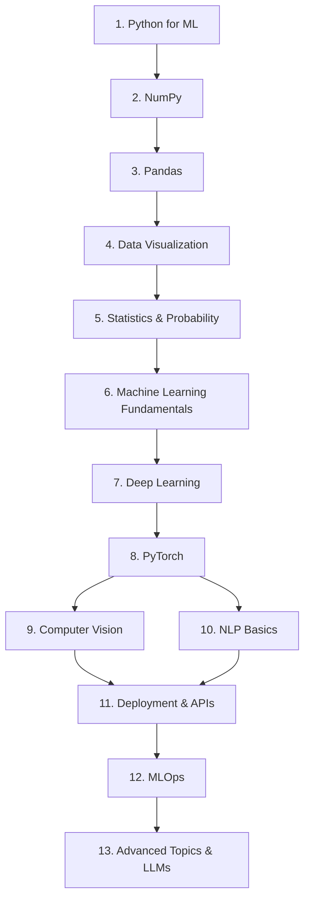

# 🗺️ Machine Learning Learning Roadmap

## 1️⃣ Stage 1: Python for ML
**⏳ Duration Estimate:** 2 weeks

**Topics:**
- Variables, Data Types, and Operators
- Control Flow (if, for, while)
- Functions and Scope
- Lists, Dictionaries, Sets, Tuples
- File I/O and Exception Handling
- Classes and Object-Oriented Programming (OOP)
- List Comprehensions and Generators
- Lambda Functions and map/filter/reduce
- Virtual Environments (`venv`, `conda`)
- Package Management (`pip`)

**Resources:**
- Python Official Documentation
- Corey Schafer Python Tutorials

**Projects to Build:** Command-line calculator, Contact book application
**Milestones:** Can write basic Python scripts and use virtual environments independently.

## 2️⃣ Stage 2: NumPy
**⏳ Duration Estimate:** 1 week

**Topics:**
- Arrays and Vectors
- Creating Arrays
- Indexing and Slicing
- Array Math Operations
- Broadcasting
- Reshaping and Transposing
- Random Number Generation
- Linear Algebra Functions

**Resources:**
- NumPy Official Tutorial
- FreeCodeCamp NumPy Tutorial

**Projects to Build:** Matrix operations library wrapper
**Milestones:** Perform math on arrays without loops.

## 3️⃣ Stage 3: Pandas
**⏳ Duration Estimate:** 1.5 weeks

**Topics:**
- Series and DataFrames
- Reading and Writing Data (CSV, Excel, JSON)
- Data Cleaning and Handling Missing Values
- Filtering and Selecting Data
- GroupBy and Aggregation
- Merging, Joining, and Concatenating
- Pivot Tables
- Date and Time Data Handling

**Resources:**
- Pandas Official Documentation
- Kaggle Pandas Course

**Projects to Build:** Clean a dirty dataset from Kaggle, basic EDA report
**Milestones:** Confidently manipulate tabular data.

## 4️⃣ Stage 4: Data Visualization
**⏳ Duration Estimate:** 1 week

**Topics:**
- Matplotlib Basics (Figures, Axes, Subplots)
- Line, Bar, Scatter, and Histogram plots
- Seaborn Basics (Statistical plots)
- Heatmaps and Correlation Matrices
- Customizing Plots (Labels, Titles, Legends)
- Interactive Visualization (Plotly Basics)

**Resources:**
- Matplotlib documentation
- Seaborn gallery

**Projects to Build:** Visual Exploratory Data Analysis (EDA) of the Titanic dataset
**Milestones:** Create publication-ready charts.

## 5️⃣ Stage 5: Statistics & Probability
**⏳ Duration Estimate:** 2 weeks

**Topics:**
- Descriptive Statistics (Mean, Median, Variance, Std Dev)
- Probability Distributions (Normal, Binomial, Poisson)
- Bayes' Theorem
- Hypothesis Testing (p-values, t-tests)
- Confidence Intervals
- Correlation vs Causation
- A/B Testing Fundamentals
- Central Limit Theorem

**Resources:**
- StatQuest with Josh Starmer
- Practical Statistics for Data Scientists (Book)

**Projects to Build:** Analyze A/B test results
**Milestones:** Understand the math behind data distributions.

## 6️⃣ Stage 6: Machine Learning Fundamentals
**⏳ Duration Estimate:** 4 weeks

**Topics:**
- Supervised vs Unsupervised Learning
- Linear Regression and Logistic Regression
- Decision Trees and Random Forests
- Support Vector Machines (SVM)
- K-Nearest Neighbors (KNN)
- K-Means Clustering and PCA
- Model Evaluation (Accuracy, Precision, Recall, F1, ROC-AUC)
- Cross-Validation and Hyperparameter Tuning
- Handling Imbalanced Data

**Resources:**
- Hands-on Machine Learning by Aurélien Géron
- Scikit-Learn Documentation

**Projects to Build:** House Price Prediction, Customer Segmentation
**Milestones:** Train, evaluate, and tune basic ML models using scikit-learn.

## 7️⃣ Stage 7: Deep Learning
**⏳ Duration Estimate:** 3 weeks

**Topics:**
- Artificial Neural Networks (ANNs)
- Forward and Backpropagation
- Activation Functions (ReLU, Sigmoid, Tanh)
- Loss Functions and Optimizers (SGD, Adam)
- Regularization (Dropout, L1/L2)
- Batch Normalization
- Hyperparameter Tuning in Deep Learning

**Resources:**
- Deep Learning Specialization by Andrew Ng (Coursera)
- 3Blue1Brown Neural Networks series

**Projects to Build:** Basic Multilayer Perceptron from scratch
**Milestones:** Understand backpropagation intuitively.

## 8️⃣ Stage 8: PyTorch
**⏳ Duration Estimate:** 2 weeks

**Topics:**
- Tensors and Autograd
- Building Neural Networks (`torch.nn`)
- Custom Datasets and DataLoaders
- Training Loops and Validation
- Saving and Loading Models
- Transfer Learning Basics
- GPU Acceleration

**Resources:**
- PyTorch Official Tutorials
- fast.ai Practical Deep Learning

**Projects to Build:** MNIST Digit Classifier with PyTorch
**Milestones:** Write custom PyTorch training loops.

## 9️⃣ Stage 9: Computer Vision
**⏳ Duration Estimate:** 3 weeks

**Topics:**
- Image Processing Basics (OpenCV)
- Convolutional Neural Networks (CNNs)
- Pooling and Padding
- Famous Architectures (ResNet, VGG)
- Object Detection Basics (YOLO)
- Image Segmentation (U-Net)
- Data Augmentation for Images

**Resources:**
- CS231n (Stanford Course)
- PyTorch Vision Tutorials

**Projects to Build:** Dog vs Cat Classifier, Basic Face Detection
**Milestones:** Train models on image data.

## 🔟 Stage 10: NLP Basics
**⏳ Duration Estimate:** 2 weeks

**Topics:**
- Text Preprocessing (Tokenization, Stemming, Lemmatization)
- Bag of Words and TF-IDF
- Word Embeddings (Word2Vec, GloVe)
- Recurrent Neural Networks (RNNs, LSTMs)
- Introduction to Attention Mechanism
- Sentiment Analysis
- Named Entity Recognition (NER)

**Resources:**
- Hugging Face NLP Course
- NLTK/Spacy documentation

**Projects to Build:** Spam Classifier, Sentiment Analysis on Movie Reviews
**Milestones:** Process text data and build simple NLP models.

## 1️⃣1️⃣ Stage 11: Deployment & APIs
**⏳ Duration Estimate:** 2 weeks

**Topics:**
- Flask and FastAPI Basics
- REST APIs for ML Models
- Docker (Images, Containers, Dockerfiles)
- Streamlit / Gradio for Web Apps
- Cloud Deployment (Heroku / AWS EC2 / Render)
- Handling API Requests and Responses

**Resources:**
- FastAPI documentation
- Docker Curriculum

**Projects to Build:** Serve the House Price model via FastAPI, Build a Streamlit UI
**Milestones:** Turn a Jupyter Notebook model into an interactive app.

## 1️⃣2️⃣ Stage 12: MLOps
**⏳ Duration Estimate:** 2 weeks

**Topics:**
- Version Control for Data (DVC)
- Experiment Tracking (MLflow, Weights & Biases)
- CI/CD Pipelines (GitHub Actions)
- Model Monitoring and Drift Detection
- Model Registry
- Automated Testing for ML

**Resources:**
- Made With ML by Goku Mohandas
- MLflow Documentation

**Projects to Build:** Add CI/CD and MLflow to an existing project
**Milestones:** Implement basic MLOps best practices.

## 1️⃣3️⃣ Stage 13: Advanced Topics & LLMs
**⏳ Duration Estimate:** Ongoing

**Topics:**
- Transformers Architecture
- Hugging Face Transformers Library
- Fine-Tuning LLMs (LoRA, QLoRA)
- Retrieval-Augmented Generation (RAG)
- Prompt Engineering
- Generative Adversarial Networks (GANs)
- Reinforcement Learning Basics

**Resources:**
- Andrej Karpathy YouTube Channel
- Hugging Face Documentation

**Projects to Build:** Custom Chatbot using RAG, Fine-tune an open-source LLM
**Milestones:** Keep up with State-of-the-Art ML developments.
